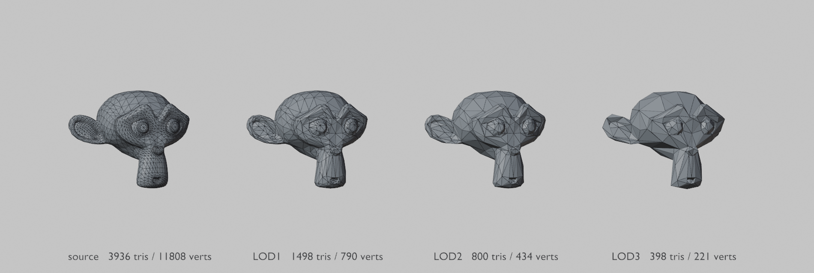
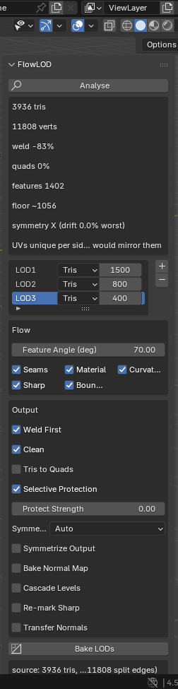

# FlowLOD

One-click LOD generation for Blender 4.2+. MIT licensed. No dependencies.



Set budgets, press bake, get clean LOD meshes in their own collection with normal maps and symmetry
intact. The reduction itself is Blender's Decimate. FlowLOD is everything around it that Blender
otherwise makes you do by hand.

## Install

Copy `flow_lod/` into your Blender addons directory, or zip it and install as an extension.
Press **N** in the 3D viewport and pick the **FlowLOD** tab.

## Use



1. Select a mesh and press **Analyse**.
2. Add levels with **+**, remove with **−**.
3. Press **Bake LODs**.

Results land in a `<Name>_LODs` collection. The source is hidden, never modified. Re-baking replaces
the previous bake rather than piling up duplicates.

Headless:

```bash
blender -b asset.blend -P flow_lod/cli.py -- --object model --budgets 3000,1500,600 --export out.glb
```

Exits non-zero if a level missed its budget, so it can gate a build.

<br clear="right">

## Pipeline

| Stage | |
|---|---|
| **Repair** | Welds split vertices. Exported meshes arrive shattered and nothing can simplify them until this runs. |
| **Clean** | Removes orphan fragments, fixes inconsistent normals, drops degenerate faces. |
| **Remove Hidden** | Deletes interior geometry no ray can reach from outside. Opt-in. |
| **Reduce** | Blender's Decimate, driven to your budget. |
| **Symmetry** | Detects the mirror axis and can enforce it exactly. |
| **Bake** | Projects the source onto each LOD as a normal map. |
| **Impostor** | Optional final level: a two-triangle card sampling a grid of pre-rendered views. |

## Budgets

Each level is set one of three ways: an absolute triangle count, a fraction of the source, or a
maximum deviation.

Deviation is the one worth knowing about. FlowLOD measures a real error curve for your mesh, then
picks the triangle count that meets your limit. A given ratio costs different error on different
models, so equalising error rather than ratio is what makes a fleet of assets look consistent
instead of just one of them looking right.

| asset | dev ≤ 0.003 | dev ≤ 0.008 | dev ≤ 0.015 |
|---|---|---|---|
| A | 90% | 50% | 18% |
| B | 70% | 35% | 18% |
| C | 70% | 25% | 12% |

At the same visual error, A keeps half its triangles and C a quarter.

## Symmetry

Error-driven simplification has no idea the left side should match the right, so symmetric models
come back asymmetric. Blender's own symmetric decimation does not fix this. It makes the collapse
pattern symmetric, not the geometry.

**Symmetrize Output** has two modes:

* **Mirror** replaces one half with a mirror of the other. Fast, but it mirrors UVs too, so a model
  whose sides have their own UVs loses that detail.
* **Rebuild UVs** keeps the sparser half, mirrors it, gives the mirror its own atlas space, then
  re-bakes both sides from the source. Exact symmetry at no texture cost. Requires baking.

Analyse tells you which case your UVs are in, and reports how far the source has drifted from
symmetry. Two percent drift usually means the source wants fixing, not the LOD.

## Normal maps

**Bake Normal Map** projects the source geometry onto each LOD. Colour textures need no rebaking:
decimation preserves the UV layout, so LODs still address your original texture set. The source's
own normal map composites into the bake.

## Remove Hidden

Generated meshes carry internal shells nothing can ever see. Measured across four assets, between
0% and 12% of faces after cleaning, and one carried 942 such faces.

FlowLOD casts hemisphere rays from every face and deletes those from which nothing escapes. This is
MeshLab's ambient-occlusion trick applied per face rather than per vertex, because judging by vertex
can delete a visible face that happens to have hidden vertices.

Sampling cannot make it provably safe. Against a ground-truth visibility sweep, 32 rays wrongly flag
5.7% of what they delete; 128 rays plus a minimum connected patch of 8 faces brings that to 2.3%.
Both are the defaults. Isolated flagged faces are treated as sampling noise, which is why one asset
flagged 2 faces and removed none.

The residual risk is bounded by where it runs. FlowLOD never modifies your source, and the normal
map is baked from the original, so a wrongly removed sliver comes back in the bake.

## Octahedral impostors

Past a certain distance no amount of triangle reduction competes with a billboard. **Impostor** adds
a final level: a two-triangle card that samples an N x N atlas of pre-rendered views and blends
between neighbours as the camera moves.

The format follows [Godot-Octahedral-Impostors](https://github.com/wojtekpil/Godot-Octahedral-Impostors)
(MIT) rather than inventing one. Four textures are written, matching that shader's uniforms:
`albedo` (alpha carries the mask), `normal`, `depth` (read from red) and, not yet implemented,
`orm`. Frame count and sphere mode are stored as custom properties on the card.

**Full Sphere** is on by default. Ships are seen from below; foliage is not, and turning it off
spends the whole atlas on the upper hemisphere for better side resolution.

The atlas is produced in a single render. Rather than 256 renders, the mesh is instanced across a
grid with each copy rotated to its cell's view direction. A 16x16 atlas at 2048px takes about two
seconds.

The encoding is a transcription of that shader's own `OctaSphereEnc` and `OctaHemiSphereEnc`, and a
test asserts our encode is the exact inverse of its decode (worst round-trip error 3e-08). Without
that the card samples a different cell than the one rendered, and no amount of shader tuning fixes
it.

### Status: not working end to end

The atlas renders, the shader loads it, and the card picks different frames as the camera moves. But
a comparison against the source mesh from matching angles does **not** line up. At a camera on Godot
+X the mesh shows a long horizontal profile and the impostor shows a short upright one, roughly 90
degrees out.

What is proven and what is not:

* **Proven.** Our cell-to-direction encoding is the exact inverse of the shader's decode, worst
  round-trip error 3e-08, asserted in the test suite for both sphere modes.
* **Not proven.** That the Blender camera direction used to render a cell corresponds to the Godot
  direction the shader computes for it. That conversion, Godot `(x, y, z)` to Blender `(x, -z, y)`,
  is the prime suspect. A wrong axis convention there produces exactly this symptom: internally
  consistent, externally rotated.
* **Also possible.** The test harness is a hand-built scene rather than the addon's own impostor
  node, and the shader may expect setup it is not getting.

The cheapest way to settle it is to place a Godot camera at a known direction, read back which
atlas cell the shader samples, and compare with the cell that direction was rendered into.

### Other gaps

* **No ORM map.** The shader defaults that sampler to white, so output is usable, but occlusion,
  roughness and metallic are not baked.
* **Upstream is Godot 3.** The reference addon does not compile in Godot 4 or Redot without porting
  (`hint_color`, `hint_albedo`, `CAMERA_MATRIX`, `ALPHA_SCISSOR` and the `1f` literal suffix all
  changed). It is MIT, so porting is permitted, but FlowLOD does not ship a shader.

## Options that cost something

All off by default:

* **Tris to Quads** recovers quad flow hidden by a triangulated export. Helps at moderate budgets,
  hurts at aggressive ones.
* **Cascade** reduces each level from the previous one. Compounds any loss down the ladder.
* **Protect Strength** weights feature vertices against collapse. Measured not to help, and at
  aggressive budgets it stops the budget being reached at all.

## Honest limits

* Decimation inherits whatever the source has. It will not fix non-manifold edges.
* Aggressive budgets degrade hard on detailed hulls. Analyse reports a structural floor so you know
  before baking, not after.
* Symmetrizing can push a level over its triangle budget. The report says so.
* FlowLOD once shipped its own quadric simplifier. It lost to Blender's Decimate by 12 to 17 points
  while running 50 times slower, so it was deleted. `DESIGN.md` keeps the measurements.

## Test

```bash
blender -b ASSET.blend --factory-startup -P tests/test_flowlod.py
```

60 checks against real geometry. No mocks. The mesh is the fixture.

## Origins

FlowLOD was designed and directed by **Solid State Games (TB)**, and built with Claude. The ideas
below are TB's, and several of them overturned conclusions the measurements had apparently already
settled.

**The flow is there even in triangle soup.** The assets profile as 0% quads, and the first analysis
concluded there was no edge flow to preserve. TB disagreed, pointing at the wireframe. He was right:
they are quad meshes that were triangulated on export, and 86.9% of the quads come back with chords
up to 55 edges long. That became the Tris to Quads stage.

**Merge by distance before anything else.** A single remark, and it invalidated the entire
evaluation. Structure fidelity was being scored against an unwelded reference mesh, which quietly
biased every result toward methods that skip welding. The pod turned out to be 9,509 vertices
welding down to 4,086.

**The half-mirror pipeline.** Symmetrizing a mesh mirrors its UVs, so a model whose sides are
unwrapped separately loses half its texture detail. TB proposed cutting down the centre, keeping the
side with fewer vertices, mirroring it, projecting the denser side's texture onto the copy, then
welding. That is the Rebuild UVs mode, and it beats the plain mirror on every measure: exact
symmetry, separate UV space, fewer triangles.

**Delete what did not work.** Asked whether failed approaches should be kept, TB's instinct was no.
An audit found that with default settings the entire flow-analysis path no longer affected output.
677 lines went.

**Reading GPL projects is fine.** An earlier draft was over-cautious, implying GPL implementations
could not even be studied. TB corrected it. Copyright covers expression, not algorithms, so reading
an implementation and writing your own is legitimate. Only copying code or translating it line by
line creates a derivative work.

Also TB's: the panel belongs in the N sidebar, Tris to Quads should be a switch rather than a
separate step, the assets are AI-generated rather than kitbashed (which redirected the gap analysis
toward mesh cleanup), and the observation that the Suzanne demo images had lost the chin volume,
which traced back to renders made with the since-deleted chord engine.

The research direction was TB's too: Simplygon as the bar to measure against, plus the MDPI
error-curve paper, TriFlow, SQuadGen and Laigter as leads to assess.

## Prior art

Built from published papers rather than from existing code: Garland & Heckbert 1997 (quadric error
metrics), Daniels et al. 2008 and 2009 (polychord collapse), Sun et al. 2026 (error-curve LOD
budgeting).

Algorithms are not copyrightable, so GPL projects including Optiloops, MeshLab and TexTools were
read where useful. No code was taken from any of them.

`DESIGN.md` has the reasoning and every measurement, including the approaches that failed.

## Licence

MIT. See `LICENSE`.
