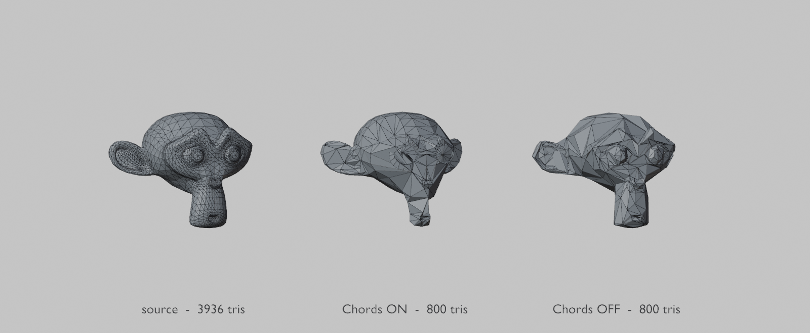

# FlowLOD

Flow-preserving LOD generation for Blender 4.2+. MIT licensed. No dependencies.

Most Blender LOD addons wrap the Decimate modifier in a percentage field. FlowLOD reads the mesh's
structure first — repairing it, recovering hidden quad topology, and classifying every edge — then
reduces along that structure, and tells you honestly when a budget is impossible.


## Install

Copy `flow_lod/` into your Blender addons directory, or zip it and install as an extension.
The panel appears in the 3D viewport sidebar: press **N**, then the **FlowLOD** tab.

## Use


1. Select a mesh, press **Analyse** to see what you're working with — triangle and vertex counts,
   what welding will save, how much quad flow is recoverable, how many feature edges were found,
   and the structural floor below which budgets become impossible.
2. Add levels with **+**, remove with **−**. Each level is either an absolute triangle target or a
   quality fraction.
3. Press **Bake LODs**. Results land in a `<Name>_LODs` collection; the source is hidden, never
   modified. Re-baking replaces the previous bake rather than accumulating duplicates.

### Tris to Quads, on its own

**Tris to Quads (Flow)** runs the repair and quad-recovery stages without generating any LODs,
producing a `<Name>_Quads` object. A triangulated import becomes an editable quad mesh again with
its original loops intact.

This always runs before LOD generation anyway — chords are made of quads, so without it there is no
flow to follow and the pipeline degrades to plain error-driven collapse. It is exposed separately
because wanting the flow back is a real task on its own.

Headless:

```bash
blender -b asset.blend -P flow_lod/cli.py -- --object model --budgets 3000,1500,600 --export out.glb
```

Exits non-zero if any level missed its budget or fell through to unconstrained collapse, so it can
gate a build.

## What it actually does

```
0. REPAIR          weld split vertices back into a manifold mesh
1. TRIS TO QUADS   recover the quad topology a triangulated export hid, flow intact
2. ANALYSE         classify edges LOCKED / FEATURE / FREE, chain features into polylines,
                   trace quad chords, report the structural floor
3. SIMPLIFY        tier 1  whole-chord collapse      (quad rows, flow kept by construction)
                   tier 2  localized chord segments  (Daniels et al. 2009)
                   tier 3  feature-constrained QEM   (Garland & Heckbert, plus constraints)
4. BAKE            re-triangulate, re-mark sharp, emit LOD objects
```

## Measured results

All numbers from `reference-asset.blend`, 6,114 triangles, via `tests/test_flowlod.py`.

**The repair is the biggest single win, and nothing else does it:**

| | verts | edges | open/non-manifold edges |
|---|---|---|---|
| as imported | 13,778 | 16,046 | 13,750 |
| welded | **3,060** | 9,182 | 57 |

78% of the vertices removed at *identical geometry*. Exported meshes arrive with every vertex split
for shading; no simplifier can work on them until this runs, because there are no shared edges and
therefore no edge flow at all.

**Quad recovery works.** De-triangulation at wide angle thresholds recovers 86.9% quads with chords
up to 55 edges long. Quad recovery is a topology problem, not a shape problem — Blender's default
shape heuristics recover only 69.4% and fragment the flow.

**Honest reporting.** The analyser computes a structural floor from the mesh's own hard edges and
flags levels below it *before* baking. On the reference asset that floor is ~1,500 triangles, so a 611
triangle level is flagged as unreachable rather than silently producing mush.

## Honest status

**The tris-to-quads recovery and the analysis are the parts that work.** The LOD generation
currently loses to Blender's own Decimate modifier on smooth hulls, and by a wide margin.

Measured on a smooth hard-surface hull, 8,168 tris, structure-fidelity F1 at matched counts:

| | 50% budget | 25% budget |
|---|---|---|
| FlowLOD | 76.6% | 61.6% |
| **Blender Decimate** | **84.4%** | **75.8%** |

The likely cause is placement. FlowLOD uses **half-edge collapse** — the surviving vertex must be
one of the two originals — which was chosen so UVs and colours are inherited rather than
interpolated. Blender's Decimate solves for the error-minimising position instead. On a smooth
curved surface that difference is large, because no original vertex sits where the simplified
surface should pass.

Three attempts to close the gap were measured and none worked: an adaptive per-mesh feature
threshold (76.6 vs 77.3 vs 78.0 across settings — noise), a triangle shape-quality guard (slivers
were already only 0.2%, below Decimate's 0.8%), and driving Decimate itself with a feature vertex
group (over-protects 52% of vertices and cannot reach the budget at all).

So use this today for **repair, tris-to-quads, and analysis**. For the reduction itself on smooth
models, Decimate is currently better, and this README would rather say so than sell you something
the measurements do not support.

## What it does not do, measured

Blender's Decimate modifier beats FlowLOD on raw structure fidelity at matched triangle count:

| | recall | precision | F1 |
|---|---|---|---|
| FlowLOD | **91.5%** | 77.6% | 83.9% |
| Decimate | 80.9% | **93.0%** | **86.5%** |

FlowLOD retains more of the original creases; Decimate produces a cleaner surface with fewer
invented ones.

**The metric and the eye disagree, though.** At an identical 800 triangle budget, chord collapse on
(middle) reads smoother and more coherent than chord collapse off (right), which is visibly lumpy:



The metric scores crease *positions*. It cannot see even topology, sliver triangles, or how a
surface shades in motion. Both numbers and picture are published here because they genuinely point
different ways, and which one matters depends on your asset. Decimate is optimal-position QEM written in C, and it is optimal *by construction* on
exactly this metric — any structure constraint trades geometric error for something else.

That "something else" is loop structure and quad retention, which this metric cannot see. So chord
collapse is **off by default for triangulated imports** and on for genuinely quad-modelled assets
(`Chord Collapse: Auto`). Measured at 3,057 triangles on the reference asset: chords on gives F1 78.8%,
chords off gives 83.9%. Removing whole quad rows is density-uniform, and on a hull whose curvature
varies that deviates more than error-driven collapse does.

Set `Chord Collapse: Always` when even topology and editable loops matter more than geometric
fidelity — a base mesh you will keep working on, rather than a shipped LOD.

Chord collapse is also **17x faster**, because removing whole quad rows is a handful of bulk
operations rather than thousands of individually validated collapses:

| mode | result | quads retained | time |
|---|---|---|---|
| `Never` | 3,056 tris, 1,532 verts | 0% | 3.5s |
| `Always` | 3,055 tris, 1,578 verts | 74% | **0.2s** |

If you are batching hundreds of assets through the CLI, that difference is the whole job.

### Known limits

- Aggressive budgets stall above target. The reference asset reaches 1,169 triangles against a 611 target;
  the link condition blocks further collapses on a mesh with many open edges. Reported, not hidden.
- LODs carry ~1-1.6% non-manifold edges. glTF and Godot are triangle-soup consumers and do not care,
  but it is a defect. Budgeted and asserted in the tests.
- Triangle meshes only for chord work, since chords need quads to exist. Quad-local operations
  (rotations, doublet and singlet removal) are not implemented.
- Chord collapse stops at 25% of the source (`chord_floor`). Pushed past that it removes rows the
  shape depends on and the silhouette collapses — measured, and the reason the guard exists.

## Test

```bash
blender -b ASSET.blend --factory-startup -P tests/test_flowlod.py
```

36 checks against real geometry — repair losslessness, quad recovery, budget adherence, topology
damage budgets, attribute survival, structure fidelity versus the Decimate baseline, and addon
registration. No mocks; the mesh is the fixture.

## Prior art

Built from the papers, not from anyone's source. Garland & Heckbert 1997 (QEM and the
perpendicular-plane boundary constraint); Daniels, Silva, Shepherd & Cohen 2008 and Daniels, Silva &
Cohen 2009 (polychord collapse and its localized form); Tarini et al. 2010 (quad-local operations).
Optiloops, MeshLab and VCGlib are GPL and were deliberately not consulted for implementation.

See `DESIGN.md` for the full reasoning and every measurement.

## License

MIT. See `LICENSE`.
